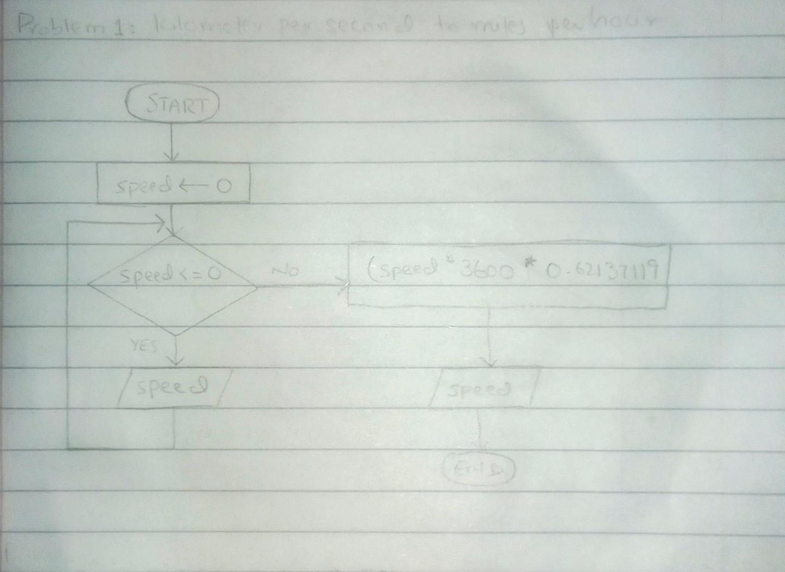

<!-- #kilometer per seconds to Miles per hour -->

## IPO

#### INPUT
- A positive integer `speed`.

#### PROCESS
- Loop to check if `speed` is greater than 0. (while)
- If valid, calculate (`speed` * 3600 * 062137119) 

#### OUTPUT
- Print `speed`

## Flowchart

## Pseudocode

      speed = 0 
      WHILE speed <= 0 DO
        PRINT "Enter the speed in kilometers per seconds: " 
        INPUT speed
      ENDWHILE
      speed = (speed * 3600 * 0.62137119)
      PRINT ("The speed is ", speed) 

  
