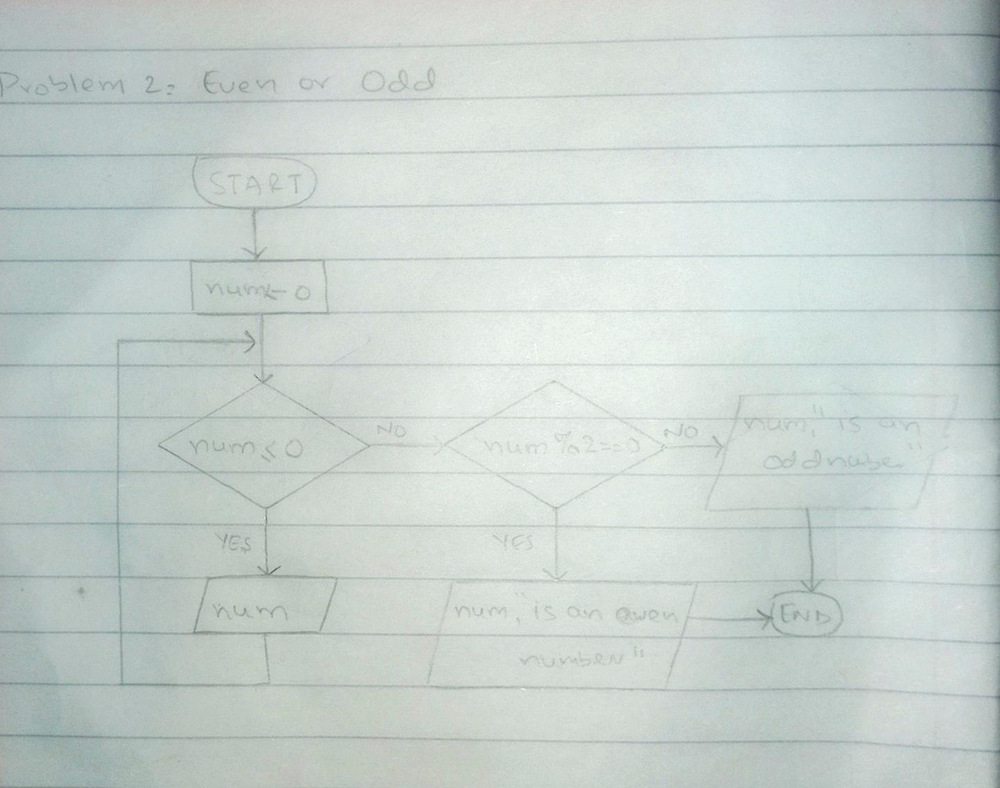

<!-- # Even or Odd -->

## IPO

#### INPUT
- A positive integer `num`.

#### PROCESS
- Check if `num` is greater than 0.
- If valid, check if `num` is even (`num % 2 == 0`).
- If `num` is not even, classify it as odd.

#### OUTPUT
- Print "Even" if `num` is even.
- Print "Odd" if `num` is odd.
- Print "Invalid input" if `num` is less than or equal to 0.

## Flowchart

## Pseudocode

      START
          INPUT num 
          WHILE num <= 0 DO
              OUTPUT "Invalid input, please enter a positive number."
              INPUT num // Ask again if input is invalid
          END WHILE
      
          IF num % 2 == 0 THEN
              OUTPUT "Even"
          ELSE
              OUTPUT "Odd"
          END IF
      END

  
