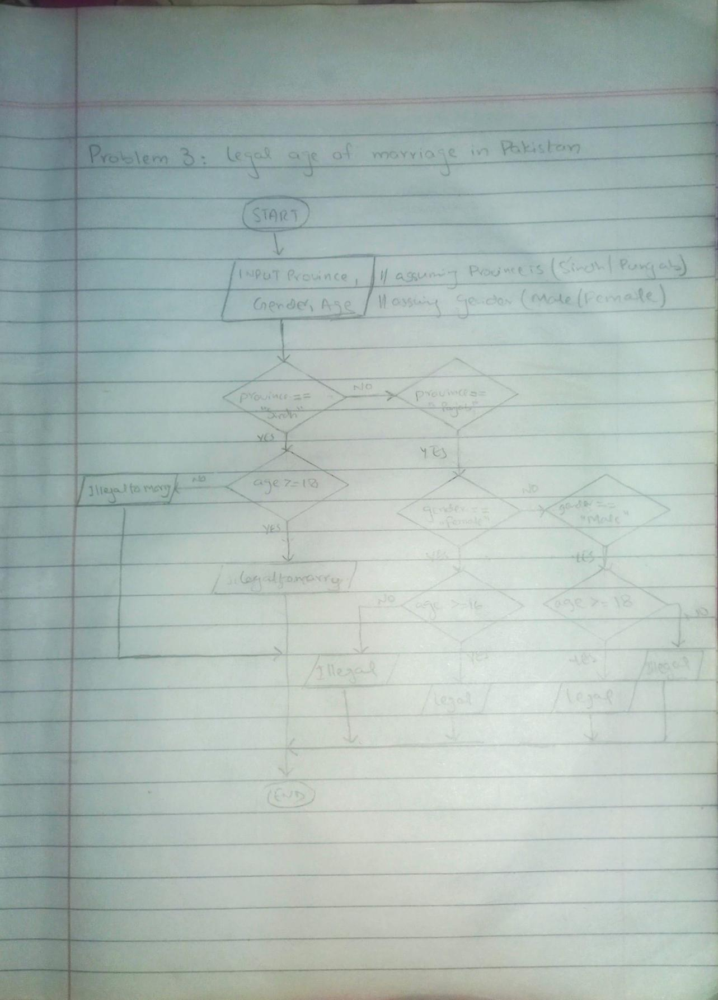

<!-- # Legal age for marriage-->

## IPO

#### INPUT
- Age
- Province (Sindh or Punjab)
- Gender (Male or Female)

#### PROCESS
- Check the province:
  - If province is Sindh:
    - Check if age >= 18.
      - If true, it is legal to marry.
      - If false, it is not legal to marry.
  - If province is Punjab:
    - Check gender:
      - If gender is Female:
        - Check if age >= 16.
          - If true, it is legal to marry.
          - If false, it is not legal to marry.
      - If gender is Male:
        - Check if age >= 18.
          - If true, it is legal to marry.
          - If false, it is not legal to marry.

#### OUTPUT
- Print "Legal to marry" if the age and province meet the criteria.
- Print "Not legal to marry" if the age and province do not meet the criteria.

## Flowchart

## Pseudocode

    START
    
        PRINT "Enter your age:" 
        INPUT age
    
        PRINT "Enter your province (Sindh or Punjab):" <!--Assuming either sindh or punjab-->
        INPUT province
    
        PRINT "Enter your gender (Male or Female):" <!--Assuming male or female-->
        INPUT gender
    
        IF province = "Sindh" THEN
            IF age >= 18 THEN
                PRINT "It is legal to marry."
            ELSE
                PRINT "It is NOT legal to marry."
            ENDIF
    
        ELSE IF province = "Punjab" THEN
            IF gender = "Female" THEN
                IF age >= 16 THEN
                    PRINT "It is legal to marry."
                ELSE
                    PRINT "It is NOT legal to marry."
                ENDIF
    
            ELSE IF gender = "Male" THEN
                IF age >= 18 THEN
                    PRINT "It is legal to marry."
                ELSE
                    PRINT "It is NOT legal to marry."
                ENDIF
            ENDIF
    
        ENDIF
    
    END

  
