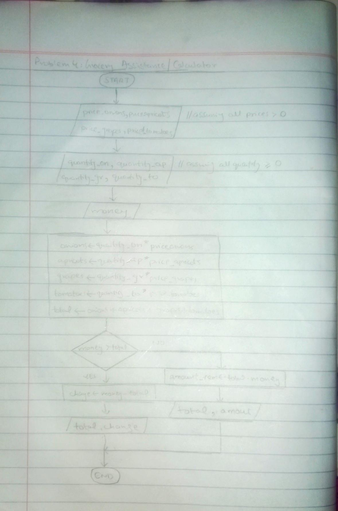

<!-- #Grocery Assistance // Calculator -->

## IPO

#### INPUT
- Price per kg of onions (`price_onions`)
- Price per kg of apricots (`price_apricots`)
- Price per kg of grapes (`price_grapes`)
- Price per kg of tomatoes (`price_tomatoes`)
- Quantity (in kg) of onions bought (`quantity_onions`)
- Quantity (in kg) of apricots bought (`quantity_apricots`)
- Quantity (in kg) of grapes bought (`quantity_grapes`)
- Quantity (in kg) of tomatoes bought (`quantity_tomatoes`)
- Money Mr. Bhoola has (`money_available`)

#### PROCESS
- Calculate the total cost for each type of vegetable:
  - `total_cost_onions = quantity_onions * price_onions`
  - `total_cost_apricots = quantity_apricots * price_apricots`
  - `total_cost_grapes = quantity_grapes * price_grapes`
  - `total_cost_tomatoes = quantity_tomatoes * price_tomatoes`
- Calculate the total cost:
  - `total_cost = total_cost_onions + total_cost_apricots + total_cost_grapes + total_cost_tomatoes`
- Compare `money_available` with `total_cost`:
  - If `money_available >= total_cost`:
    - Calculate the change:
      - `change = money_available - total_cost`
  - Else:
    - Calculate the additional amount needed:
      - `amount_needed = total_cost - money_available`

#### OUTPUT
- If `money_available >= total_cost`:
  - Print the total cost.
  - Print the amount of change Mr. Bhoola gets back.
- Else:
  - Print the total cost.
  - Print the additional amount Mr. Bhoola needs.

## Flowchart

## Pseudocode

    START

        <!--  assuming all the prices entered are > 0 -->
        
        PRINT "Enter the price per kg of onions:" 
        INPUT price_onions
    
        PRINT "Enter the price per kg of apricots:"
        INPUT price_apricots
    
        PRINT "Enter the price per kg of grapes:"
        INPUT price_grapes
    
        PRINT "Enter the price per kg of tomatoes:"
        INPUT price_tomatoes

        <!-- Assuming quantity is >= 0 -->
        
        PRINT "Enter the quantity (in kg) of onions Mr. Bhoola buys:"
        INPUT quantity_onions
    
        PRINT "Enter the quantity (in kg) of apricots Mr. Bhoola buys:"
        INPUT quantity_apricots
    
        PRINT "Enter the quantity (in kg) of grapes Mr. Bhoola buys:"
        INPUT quantity_grapes
    
        PRINT "Enter the quantity (in kg) of tomatoes Mr. Bhoola buys:"
        INPUT quantity_tomatoes
    
        PRINT "Enter the amount of money Mr. Bhoola has:"
        INPUT money_available
    
        total_cost_onions = quantity_onions * price_onions
        total_cost_apricots = quantity_apricots * price_apricots
        total_cost_grapes = quantity_grapes * price_grapes
        total_cost_tomatoes = quantity_tomatoes * price_tomatoes
    
        total_cost = total_cost_onions + total_cost_apricots + total_cost_grapes + total_cost_tomatoes
    
        IF money_available >= total_cost THEN
            change = money_available - total_cost
            PRINT "The total cost is $" + total_cost
            PRINT "Mr. Bhoola gets back $" + change
        ELSE
            amount_needed = total_cost - money_available
            PRINT "The total cost is $" + total_cost
            PRINT "Mr. Bhoola needs an additional $" + amount_needed
        ENDIF
    
    END

  
