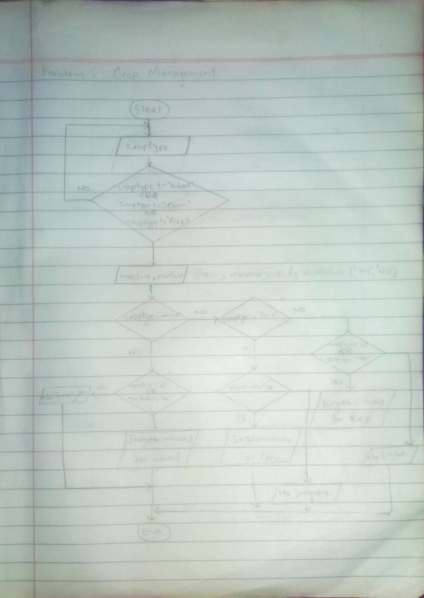

<!-- #Crop Management  -->

## IPO

# IPO Chart for Crop Management

#### INPUT
- Crop type (`crop_type`)
- Soil moisture level (`soil_moisture`)
- Rainfall status (`rainfall_status`)

#### PROCESS
- Validate the crop type using a `do-while` loop:
  - Prompt user to enter the crop type.
  - Repeat until `crop_type` is "Wheat", "Corn", or "Rice".
- Check soil moisture level and rainfall status:
  - If `crop_type` is "Wheat":
    - If `soil_moisture` < 30 and `rainfall_status` = "No", then initiate irrigation.
    - Otherwise, no irrigation needed.
  - If `crop_type` is "Corn":
    - If `soil_moisture` < 40, then initiate irrigation.
    - Otherwise, no irrigation needed.
  - If `crop_type` is "Rice":
    - If `soil_moisture` < 25 and `rainfall_status` = "No", then initiate irrigation.
    - Otherwise, no irrigation needed.

#### OUTPUT
- Print whether irrigation will be initiated or not based on the crop type, soil moisture level, and rainfall status.

## Flowchart

## Pseudocode

      START
      
          DO
              PRINT "Enter the crop type (Wheat, Corn, or Rice):"
              INPUT crop_type
          WHILE crop_type != "Wheat" AND crop_type != "Corn" AND crop_type != "Rice"
      
          PRINT "Enter the soil moisture level (%):"
          INPUT soil_moisture
      
          PRINT "Has it rained in the last 24 hours? (Yes or No):"
          INPUT rainfall_status
      
          IF crop_type = "Wheat" THEN
              IF soil_moisture < 30 AND rainfall_status = "No" THEN
                  PRINT "Irrigation will be initiated for Wheat."
              ELSE
                  PRINT "No irrigation needed for Wheat."
              ENDIF
      
          ELSE IF crop_type = "Corn" THEN
              IF soil_moisture < 40 THEN
                  PRINT "Irrigation will be initiated for Corn."
              ELSE
                  PRINT "No irrigation needed for Corn."
              ENDIF
      
          ELSE IF crop_type = "Rice" THEN
              IF soil_moisture < 25 AND rainfall_status = "No" THEN
                  PRINT "Irrigation will be initiated for Rice."
              ELSE
                  PRINT "No irrigation needed for Rice."
              ENDIF
      
          ENDIF
      
      END

  
