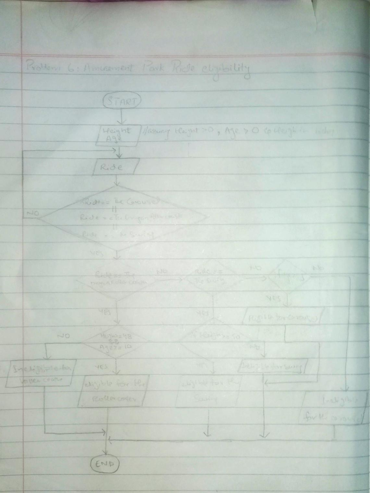

<!-- # -->

## IPO

#### INPUT
- Crop type (`crop_type`)
- Soil moisture level (`soil_moisture`)
- Rainfall status (`rainfall_status`)

#### PROCESS
- Validate the crop type using a `do-while` loop:
  - Prompt user to enter the crop type.
  - Repeat until `crop_type` is "Wheat", "Corn", or "Rice".
- Check soil moisture level and rainfall status:
  - If `crop_type` is "Wheat":
    - If `soil_moisture` < 30 and `rainfall_status` = "No", then initiate irrigation.
    - Otherwise, no irrigation needed.
  - If `crop_type` is "Corn":
    - If `soil_moisture` < 40, then initiate irrigation.
    - Otherwise, no irrigation needed.
  - If `crop_type` is "Rice":
    - If `soil_moisture` < 25 and `rainfall_status` = "No", then initiate irrigation.
    - Otherwise, no irrigation needed.

#### OUTPUT
- Print whether irrigation will be initiated or not based on the crop type, soil moisture level, and rainfall status.

## Flowchart

## Pseudocode

      START
      
          PRINT "Enter your height in inches:"
          INPUT height
          WHILE height <= 0 DO
              PRINT "Invalid height. Please enter a valid height in inches:"
              INPUT height
          ENDWHILE
      
          PRINT "Enter your age:"
          INPUT age
          WHILE age <= 0 DO
              PRINT "Invalid age. Please enter a valid age:"
              INPUT age
          ENDWHILE

          // assuming roller coaster, sky swing, carousel
          PRINT "Enter the ride you want to take (Dragon Roller Coaster, Sky Swing, Carousel):"
          INPUT ride
      
          DO
              IF ride != "Dragon Roller Coaster" AND ride != "Sky Swing" AND ride != "Carousel" THEN
                  PRINT "Invalid ride selection. Please enter a valid ride (Dragon Roller Coaster, Sky Swing, Carousel):"
                  INPUT ride
              ENDIF
          WHILE ride != "Dragon Roller Coaster" AND ride != "Sky Swing" AND ride != "Carousel"
      
          // Dragon Roller Coaster 
          IF ride = "Dragon Roller Coaster" THEN
              IF height >= 48 AND age >= 10 THEN
                  PRINT "You can ride the Dragon Roller Coaster."
              ELSE
                  PRINT "You do not meet the height or age requirements for the Dragon Roller Coaster."
              ENDIF
      
          // Sky Swing 
          ELSE IF ride = "Sky Swing" THEN
              IF height >= 54 THEN
                  PRINT "You can ride the Sky Swing."
              ELSE
                  PRINT "You do not meet the height requirement for the Sky Swing."
              ENDIF
      
          // Carousel 
          ELSE IF ride = "Carousel" THEN
              IF age >= 5 THEN
                  PRINT "You can ride the Carousel."
              ELSE
                  PRINT "You do not meet the age requirement for the Carousel."
              ENDIF
      
          ENDIF
      END
      
      
        
