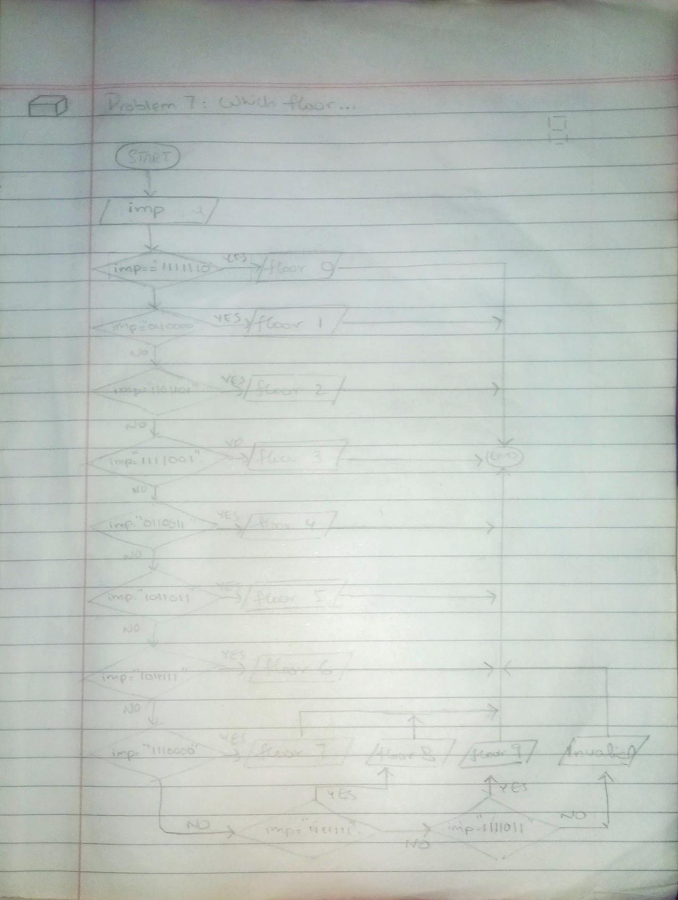

<!-- #Which Floor... -->

## IPO

#### INPUT
-  A 7 digit binary number (`segment_input`).

#### PROCESS
- Match the `segment_input` with the corresponding floor number:
  - If `segment_input = "1111110"`, the floor is 0.
  - If `segment_input = "0110000"`, the floor is 1.
  - If `segment_input = "1101101"`, the floor is 2.
  - If `segment_input = "1111001"`, the floor is 3.
  - If `segment_input = "0110011"`, the floor is 4.
  - If `segment_input = "1011011"`, the floor is 5.
  - If `segment_input = "1011111"`, the floor is 6.
  - If `segment_input = "1110000"`, the floor is 7.
  - If `segment_input = "1111111"`, the floor is 8.
  - If `segment_input = "1111011"`, the floor is 9.
  - Otherwise, print "Invalid input".

#### OUTPUT
- Print the corresponding floor number or an error message if the input is invalid.

## Flowchart

## Pseudocode

      START
        PRINT "Enter the 7-segment binary number (7 digits):"
        INPUT segment_input
    
        // Step 2: Match the input with corresponding floor number
        IF segment_input = "1111110" THEN
            PRINT "The lift is on floor 0."
        ELSE IF segment_input = "0110000" THEN
            PRINT "The lift is on floor 1."
        ELSE IF segment_input = "1101101" THEN
            PRINT "The lift is on floor 2."
        ELSE IF segment_input = "1111001" THEN
            PRINT "The lift is on floor 3."
        ELSE IF segment_input = "0110011" THEN
            PRINT "The lift is on floor 4."
        ELSE IF segment_input = "1011011" THEN
            PRINT "The lift is on floor 5."
        ELSE IF segment_input = "1011111" THEN
            PRINT "The lift is on floor 6."
        ELSE IF segment_input = "1110000" THEN
            PRINT "The lift is on floor 7."
        ELSE IF segment_input = "1111111" THEN
            PRINT "The lift is on floor 8."
        ELSE IF segment_input = "1111011" THEN
            PRINT "The lift is on floor 9."
        ELSE
            PRINT "Invalid input."
        ENDIF
      END

  
