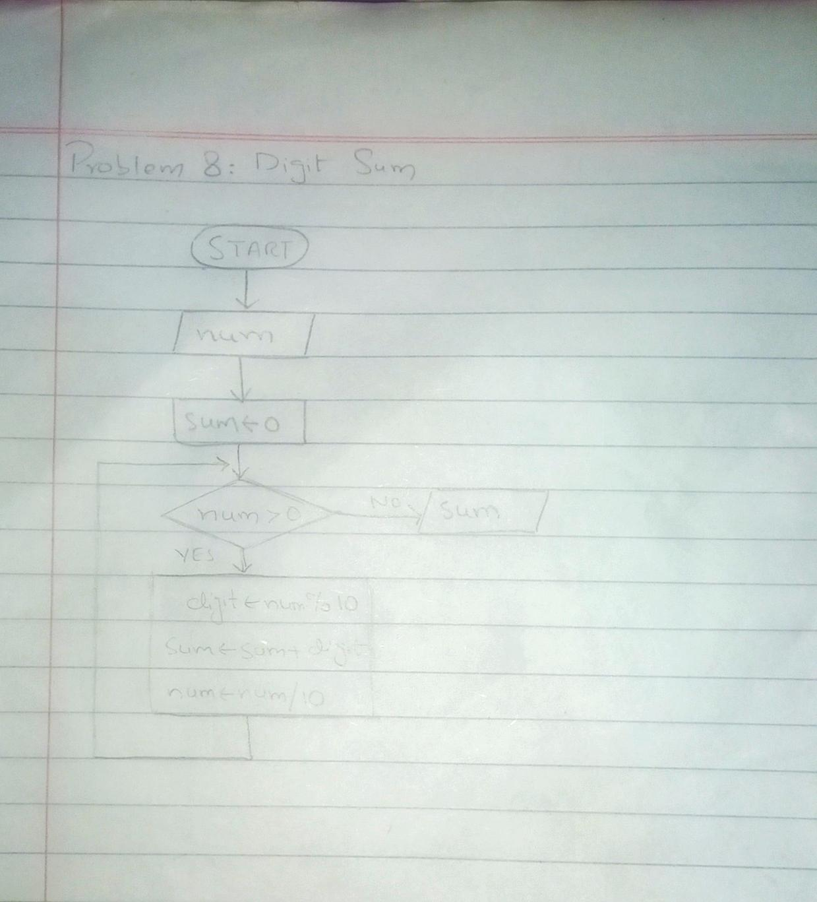

<!-- #Digit Sum -->

## IPO

#### INPUT
- Enter a `number`.

#### PROCESS
- Initialize `sum = 0`.
- Repeat until the number is greater than 0 using a `while` loop:
  - Extract the last digit using `number % 10`.
  - Add the last digit to `sum`.
  - Remove the last digit from `number` using `number / 10`.
- Continue until the number becomes 0.

#### OUTPUT
- `Sum` of the digits of the input number.

## Flowchart

## Pseudocode

    START
        PRINT "Enter a number:"
        INPUT num
    
        sum = 0
    
        WHILE num > 0
            // Extracting the last digit using %10
            digit = num % 10
            // Adding the digit to the sum
            sum = sum + digit
            // Removing the last digit using integer division
            num = num / 10
        END WHILE
    
        PRINT "The sum of the digits is:", sum
    END

  
