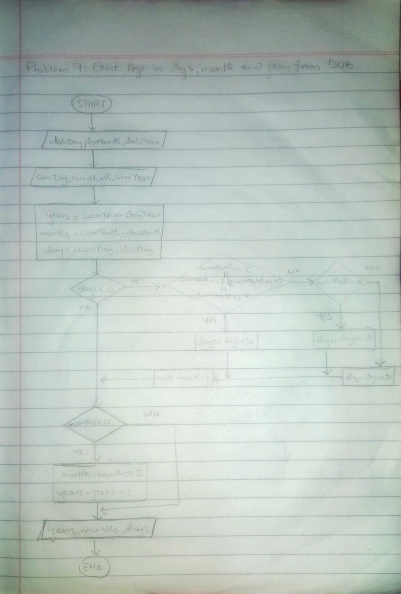

<!-- # -->

## IPO

#### INPUT
- `dobDay`: The day of birth (integer)
- `dobMonth`: The month of birth (integer)
- `dobYear`: The year of birth (integer)
- `currDay`: The current day (integer)
- `currMonth`: The current month (integer)
- `currYear`: The current year (integer)

#### PROCESS
- **Validate Input**:
  - Check if `dobDay`, `dobMonth`, and `dobYear` form a valid date.
  - Ensure the provided date is realistic and falls within acceptable ranges.

- **Calculate Preliminary Age**:
  - Calculate preliminary age in years by subtracting `dobYear` from `currYear`.
  - Determine preliminary age in months and days.

- **Adjust for Date Differences**:
  - If `currDay` is less than `dobDay`, adjust the day calculation by adding days from the previous month and decrementing `ageMonths` by 1.
  - If `currMonth` is less than `dobMonth`, adjust the month calculation by adding 12 months to `currMonth` and decrementing `ageYears` by 1.

- **Finalize Age Calculation**:
  - Ensure final age values are accurate, taking into account all adjustments.

#### OUTPUT
- `ageYears`: Exact age in years
- `ageMonths`: Exact age in months
- `ageDays`: Exact age in days

## Flowchart

## Pseudocode

      START
          PRINT "Enter the date of birth (DD MM YYYY):"
          INPUT dobDay, dobMonth, dobYear
      
          // Validating month of date of birth
          WHILE dobMonth < 1 OR dobMonth > 12 DO
              PRINT "Invalid month in DOB. Please enter a month between 1 and 12."
              INPUT dobMonth
          END WHILE
      
          // Validating day of date of birth
          IF dobMonth = 2 THEN
              WHILE dobDay < 1 OR dobDay > 28 DO
                  PRINT "Invalid day for February in DOB. Please enter a day between 1 and 28."
                  INPUT dobDay
              END WHILE
          ELSE IF dobMonth = 4 OR dobMonth = 6 OR dobMonth = 9 OR dobMonth = 11 THEN
              WHILE dobDay < 1 OR dobDay > 30 DO
                  PRINT "Invalid day for the given month in DOB. Please enter a day between 1 and 30."
                  INPUT dobDay
              END WHILE
          ELSE
              WHILE dobDay < 1 OR dobDay > 31 DO
                  PRINT "Invalid day for the given month in DOB. Please enter a day between 1 and 31."
                  INPUT dobDay
              END WHILE
          END IF
      
          PRINT "Enter the current date (DD MM YYYY):"
          INPUT currDay, currMonth, currYear
      
          // Validating month of current date
          WHILE currMonth < 1 OR currMonth > 12 DO
              PRINT "Invalid month in current date. Please enter a month between 1 and 12."
              INPUT currMonth
          END WHILE
      
          // Validating day of current date
          IF currMonth = 2 THEN
              WHILE currDay < 1 OR currDay > 28 DO
                  PRINT "Invalid day for February in current date. Please enter a day between 1 and 28."
                  INPUT currDay
              END WHILE
          ELSE IF currMonth = 4 OR currMonth = 6 OR currMonth = 9 OR currMonth = 11 THEN
              WHILE currDay < 1 OR currDay > 30 DO
                  PRINT "Invalid day for the given month in current date. Please enter a day between 1 and 30."
                  INPUT currDay
              END WHILE
          ELSE
              WHILE currDay < 1 OR currDay > 31 DO
                  PRINT "Invalid day for the given month in current date. Please enter a day between 1 and 31."
                  INPUT currDay
              END WHILE
          END IF
      
          years = currYear - dobYear
          months = currMonth - dobMonth
          days = currDay - dobDay
      
          WHILE days < 0 DO
              days = days + 30 // Assuming 30 days in a month
              months = months - 1
          END WHILE
      
          WHILE months < 0 DO
              months = months + 12
              years = years - 1
          END WHILE
      
          PRINT "Exact age is: ", years, " years, ", months, " months, and ", days, " days."
      END

      
      
        
