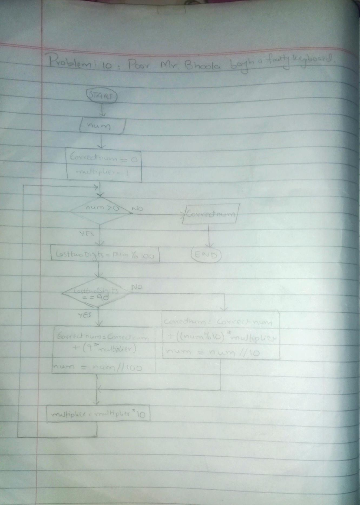

<!-- # -->

## IPO

#### INPUT
- `faultyNumber`: The number with faulty "90" sequences (integer)

#### PROCESS
- Initialize Variables:
  - `correctedNumber`: Set to 0
  - `multiplier`: Set to 1

- Process Each Digit:
  - Loop(`while`):
    - Extract the last two digits of `faultyNumber`.
    - If last two digits are '90':
      - Treat as '9' and add `9 * multiplier` to `correctedNumber`.
      - Remove the last two digits from `faultyNumber`.
    - Else:
      - Add the last digit of `faultyNumber` to `correctedNumber`.
      - Remove the last digit from `faultyNumber`.
    - Update `multiplier` by multiplying it by 10 to shift to the next place value.

- Output:
  - Print the `correctedNumber`.

#### OUTPUT
- `correctedNumber`: The corrected number with '90' sequences replaced by '9'

## Flowchart

## Pseudocode

      START
      
          PRINT "Enter the faulty number:"
          INPUT faultyNumber
      
          correctedNumber = 0
          multiplier = 1
      
          WHILE faultyNumber > 0 DO
              // getting last two digits
              lastTwoDigits = faultyNumber % 100
      
              IF lastTwoDigits = 90 THEN
                  // making 90 a 9
                  correctedNumber = correctedNumber + (9 * multiplier)
                  // faulty number removed
                  faultyNumber = faultyNumber // 100  
              ELSE
                  // last digit not 90, add it normally
                  correctedNumber = correctedNumber + ((faultyNumber % 10) * multiplier)
                  // Removing the last digit
                  faultyNumber = faultyNumber // 10  
              END IF
      
              // multiplier in order to compensate
              multiplier = multiplier * 10
          END WHILE
      
          PRINT "The corrected number is: ", correctedNumber
      
      END

  
