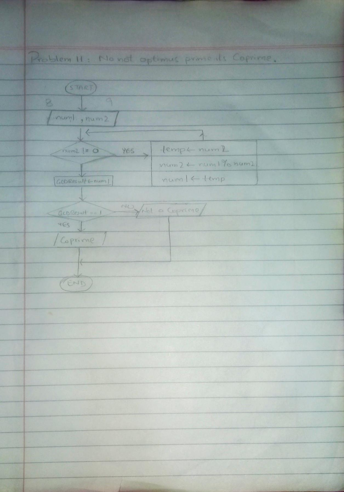

<!-- # -->

## IPO

#### INPUT
- Two positive numbers, `num1` and `num2`

#### PROCESS
- Loop (while): repeat until num2 != 0
  - `temp` = `num2`
  - `num2` = `num1` % `num2`
  - `num1` = `temp`
  
- Store the result(`num1`) in `gcdResult`

- IF: Check if `gcdResult` = 1
  - IF true, print "The numbers are coprime."
  - ELSE print "The numbers are not coprime."

#### OUTPUT
- Output if the numbers are coprime or not

## Flowchart

## Pseudocode

START

    PRINT "Enter the first number:"
    INPUT num1
    PRINT "Enter the second number:"
    INPUT num2

    // The Euclidean algorithm 
    WHILE num2 != 0 DO
        temp = num2
        num2 = num1 % num2
        num1 = temp
    END WHILE

    // stored in gcd just to ,make it readable
    gcdResult = num1

    IF gcdResult = 1 THEN
        PRINT "The numbers are coprime."
    ELSE
        PRINT "The numbers are not coprime."
    END IF

END

  
