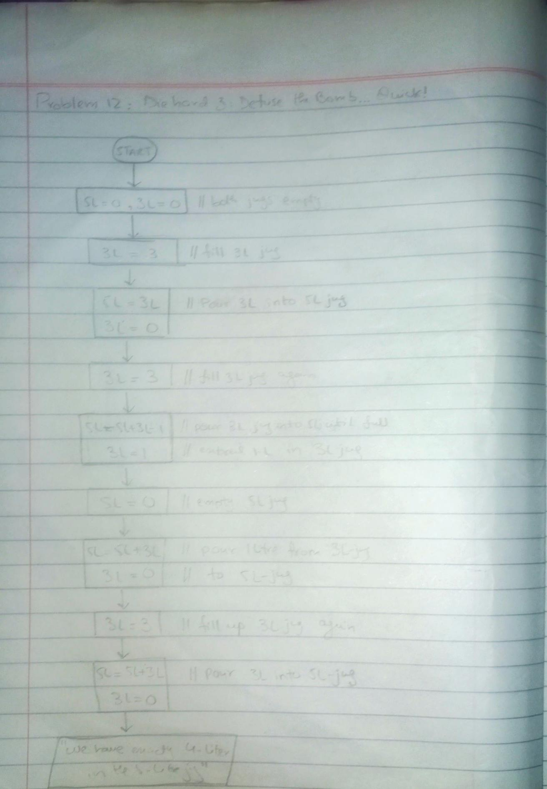

<!-- # -->

## IPO

#### INPUT
- 5-liter jug and 3-liter jug, both initially empty

#### PROCESS
- Loop (while): Follow these steps to measure exactly 4 liters:
  - Fill the 3-liter jug to the top (3L = 3)
  - Pour 3 liters from the 3-liter jug into the 5-liter jug (5L = 3, 3L = 0)
  - Fill the 3-liter jug again to the top (3L = 3)
  - Pour 3 liters from the 3-liter jug into the 5-liter jug until the 5-liter jug is full (5L = 5, 3L = 1)
  - Empty the 5-liter jug (5L = 0)
  - Pour the remaining 1 liter from the 3-liter jug into the 5-liter jug (5L = 1, 3L = 0)
  - Fill the 3-liter jug again to the top (3L = 3)
  - Pour 3 liters from the 3-liter jug into the 5-liter jug (5L = 4, 3L = 0)

#### OUTPUT
- Message indicating that there are exactly 4 liters in the 5-liter jug

## Flowchart

## Pseudocode

      START
          5L = 0  // 5-liter jug is empty
          3L = 0  // 3-liter jug is empty
      
          // Fill 3-liter jug
          3L = 3
      
          // Pour 3L into 5L
          5L = 3
          3L = 0
      
          // Fill 3-liter jug again
          3L = 3
      
          // Pour 3L into 5L (5L is now full)
          5L = 5
          3L = 1
      
          // Empty 5-liter jug
          5L = 0
      
          // Pour remaining 1L from 3L into 5L
          5L = 1
          3L = 0
      
          // Fill 3-liter jug again
          3L = 3
      
          // Pour 3L into 5L (5L now has 4 liters)
          5L = 4
          3L = 0
          
          OUTPUT "You have exactly 4 liters in the 5-liter jug."
      END

  
