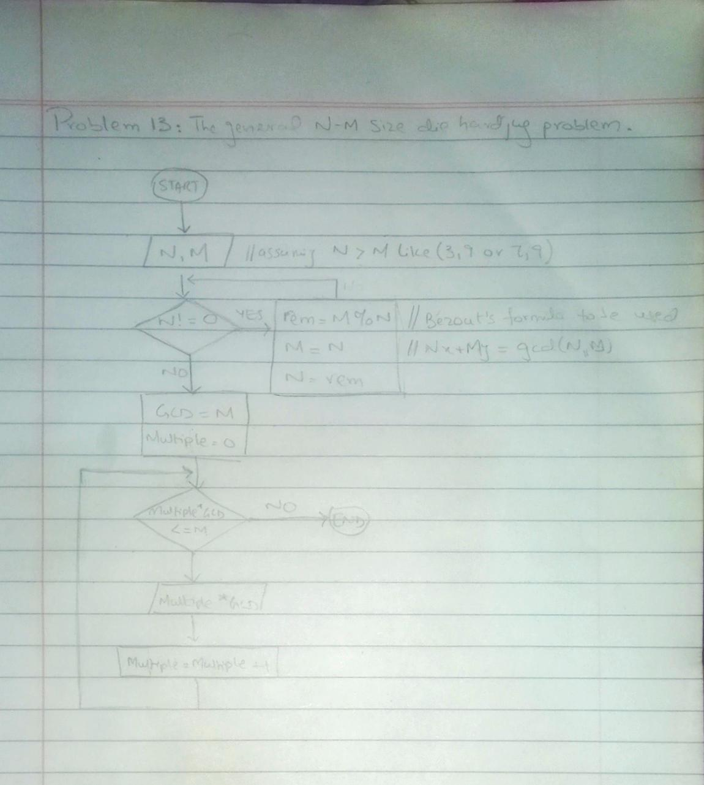

<!-- # -->

## IPO

#### INPUT
- `N` (Capacity of the first jug)
- `M` (Capacity of the second jug)

#### PROCESS
- Loop (while): Calculate GCD using the Euclidean algorithm
  - If `N > M`, then swap `N` and `M` to ensure `N < M`
  - Use the Euclidean algorithm to calculate the GCD:
    - While `N != 0`:
      - `REMAINDER = M % N`
      - `M = N`
      - `N = REMAINDER`
  - Now `M` contains the GCD of the original `N` and `M`

- Loop (do-while): Output all multiples of GCD up to the larger jug's capacity
  - Initialize `MULTIPLE` to 0
  - Output `(MULTIPLE * GCD)`
  - Increment `MULTIPLE`
  - Continue while `(MULTIPLE * GCD) <= M`

#### OUTPUT
- List of all possible values of water that can be measured using the jugs, up to the capacity of the larger jug

## Flowchart

## Pseudocode

      START
          INPUT N  // Capacity of the first jug
          INPUT M  // Capacity of the second jug
      
          IF N > M THEN
              SWAP N and M  // Ensure N < M for convenience
          END IF
      
          // Calculate GCD [Euclidean algorithm]
          WHILE N != 0 DO
              REMAINDER = M % N
              M = N
              N = REMAINDER
          END WHILE
      
          GCD = M  
      
          OUTPUT "The possible values of water you can measure are:"
      
          // counter for GCD
          MULTIPLE = 0
      
          // Output all multiples of GCD up to the larger jug's capacity using do-while loop
          DO
              OUTPUT (MULTIPLE * GCD)
              MULTIPLE = MULTIPLE + 1
          WHILE (MULTIPLE * GCD) <= M  // Continue while multiple is less than or equal to larger jug's capacity
      END

  
