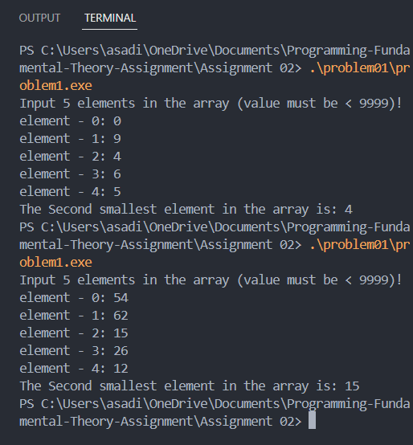

## Write a c program to find the second smallest element in an array.

### Output cases

### Approch 

First, iterate through the array to identify the smallest element. In a second pass, ignore the smallest and find the next smallest number, ensuring it is distinct. Validate the input to ensure it contains enough elements to have a “second smallest” (minimum of two unique elements).

### Conclusion

Learned how to avoid sorting for optimization and handle edge cases in searching for the second smallest element.

