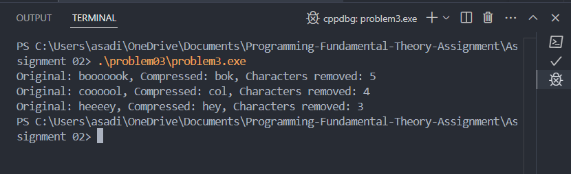

Q. You are working for a text-processing company that optimizes storage for large amounts of writtendata. The company has identified a recurring issue: words in documents are often unnecessarily lengthy due to repeated consecutive characters. Your task is to minimize these words by reducingconsecutive duplicate characters to a single instance of the character.
 Operations:
- Compress a Word: Write a function that takes a string (a word) as input and returns a minimized version of the word, where all consecutive duplicate letters are reduced to one.
- Multiple Word Compression: You will then apply this function to a list of words and return the minimized version for each word.
Add a feature to calculate how many characters were removed during the compression process.

### Output cases

### Approch 

Loop through each character of a word, only adding it to the result if it differs from the previous character to avoid duplicates. Track the count of removed characters for compression stats, and repeat the process for each word in the list.

### Conclusion

Strengthened knowledge of string manipulation techniques and gained insight into tracking changes across transformations.

