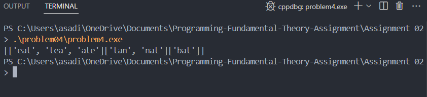

Q. You are working as a software engineer at a company that manages a large database of customer
transactions. Each transaction is stored as a string that contains encoded information about the
customer. However, some transactions may have been duplicated due to system errors, and these
duplicates appear in scrambled order. Your task is to identify and group these "scrambled"
transactions together, as they represent the same customer activity. Two transactions are considered
scrambled if they contain the same letters but in a different order (anagrams). You are provided with
a list of transaction strings. You need to write a program that groups these scrambled transactions
into separate categories, returning each group of related transactions together.

### Output cases

### Approch 

For each transaction, create a canonical (sorted) form of the characters. Use a hash map where keys are sorted strings and values are lists of original transactions. Append transactions to the lists to form groups based on anagram equivalency.

### Conclusion

This exercise highlighted sorting and hashing techniques for pattern recognition and group-based organization.

