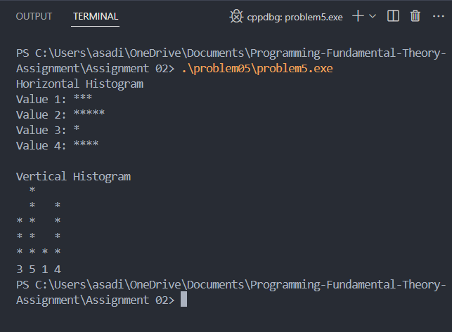
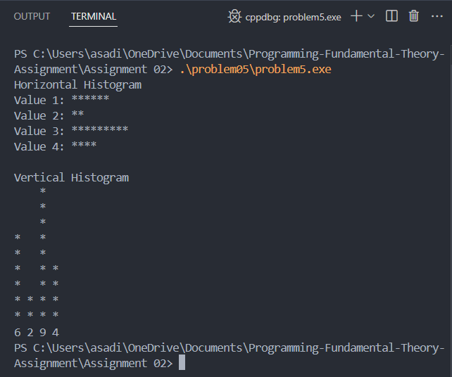

Q. You are tasked with creating a program that generates a histogram based on user input. The user will provide a set of values, and your program will use loops to create a visual representation of these values.
- Input Handling: Write a function that takes an array of integers (the values) and the count of
those integers as input.
- Horizontal Histogram Function: Use loops to generate and print a histogram, where each
value is represented by asterisks (*).
- Vertical Histogram Function: Use loops to generate and print a vrtical histogram, where
each value is represented by asterisks (*).

### Output cases

### Approch 

For a horizontal histogram, loop over each value and print a row of asterisks matching its count. 
 For a vertical histogram, find the maximum value, then print one row for each level, aligning asterisks vertically for each value in the list.

### Conclusion

Gained experience in nested looping for visual output and learned different ways to present data visually in a programmatic format.
