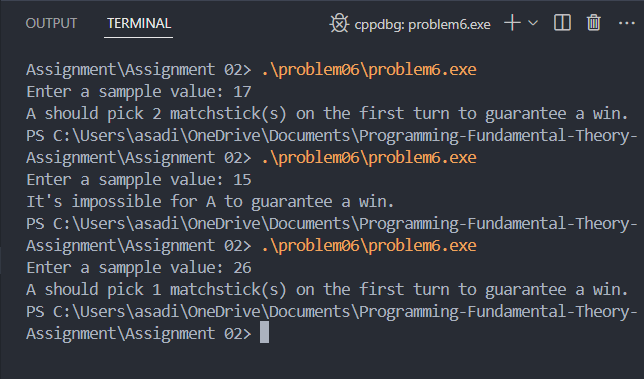

Q. Two friends, A and B, are playing the game of matchsticks. In this game, a group of N matchsticks is placed on the table. The players can pick any number of matchsticks from 1 to 4 (both inclusive) during their chance. The player who takes the last matchstick wins the game. If A starts first, how many matchsticks should he pick on his 1st turn such that he is guaranteed to win the game or determine if it’s impossible for him to win? Write a function which returns -1 if it’s impossible for A to win the game, else return the number of matchsticks he should pick on his 1st turn such that he is guaranteed to win.

### Output cases

### Approch 

Use modular arithmetic to determine if A can always win based on whether the total number of matchsticks leaves a remainder of zero when divided by 5. If possible, calculate the optimal first move; otherwise, return -1.

### Conclusion

Practiced logical reasoning to solve strategic game problems, reinforcing the importance of mathematical analysis in coding.
