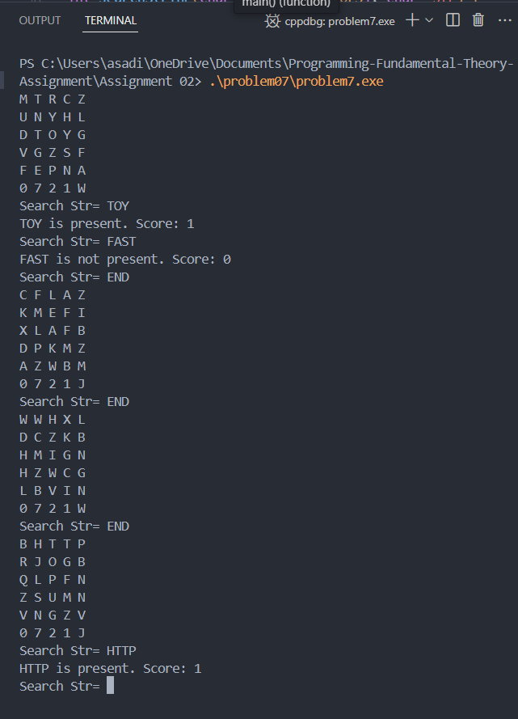

Q. One of the master coders designed a subscript block that stores random characters in a multidimensional array. You are asked to design a program that will find a given string in a multidimensional array of characters. The search for characters can be present and operational from left to right and top to down only. The program should create a 6 x 5 2D array and populate it with random alphabet characters. After that, the program should print it in a tabular form as shown below. Search the user-entered string in the 2D array, if it is present then add a point to the score, if it is not available then subtract one. Print the score at every input. The program stops asking and re-populates the 2D array with new random characters when the user enters “END” as the string.

### Output cases

### Approch 

Populate a 2D array with random alphabet characters. For each user-inputted search string, look for matching sequences horizontally and vertically, updating a score that increases for matches and decreases for misses.

### Conclusion

Improved handling of multidimensional arrays and learned random library a part of stdlib.h using time.h library as the seed for random.

