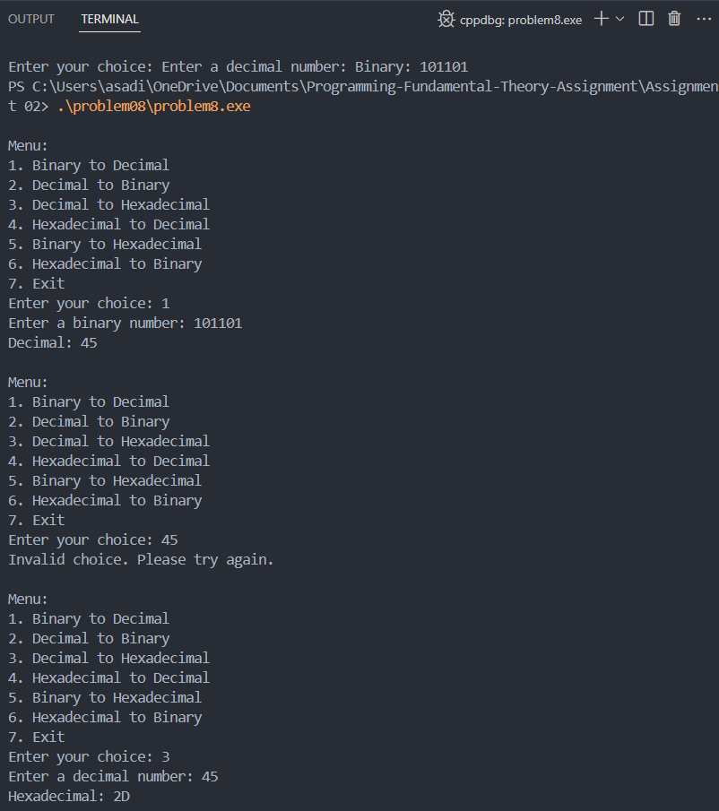
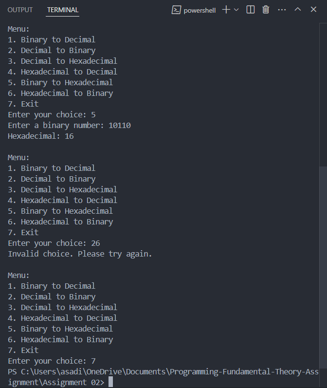

Q. Write a C program that contains the following functions for different numerical conversions:
- int BinaryToDecimal(int number); Converts a binary number to its decimal equivalent.
- int DecimalToBinary(int number); Converts a decimal number to its binary equivalent.
- void DecimalToHexadecimal(int number); Converts a decimal number to its hexadecimal equivalent and prints it.
- void HexadecimalToDecimal(string hexNumber); Converts a hexadecimal number to its
decimal equivalent and prints it.
- void BinaryToHexadecimal(int number); Converts a binary number to its hexadecimal
equivalent and prints it.
- void HexadecimalToBinary(string hexNumber); Converts a hexadecimal number to its binary
equivalent and prints it.

Each function should take an appropriate input and return or display the converted value. Ensure that
the program handles invalid inputs gracefully. Your program must display the menu which function
the user wants to call.

### Output cases

### Approch 

Implement functions for each type of conversion: binary-to-decimal using binary bit manipulation, decimal-to-binary with successive division, and hexadecimal conversions with lookup tables. Including error handling for invalid input formats.

### Conclusion

Gained hands-on practice with different numerical bases and the logic required for accurate data conversion between systems.

