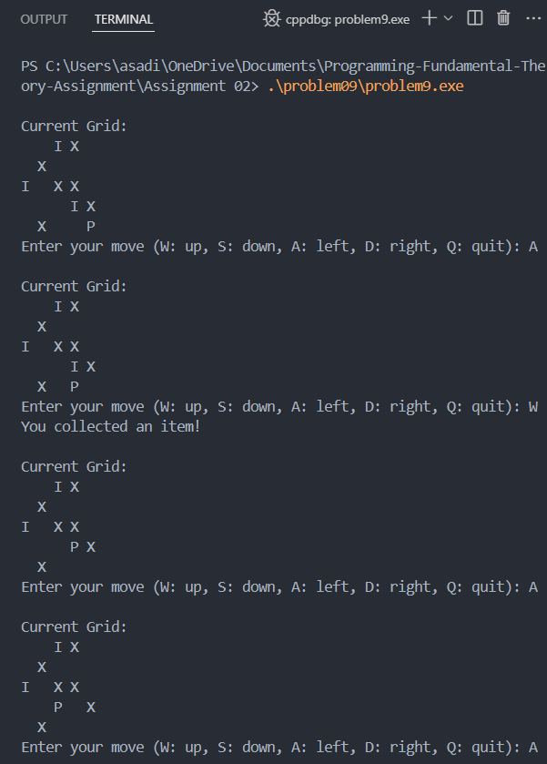
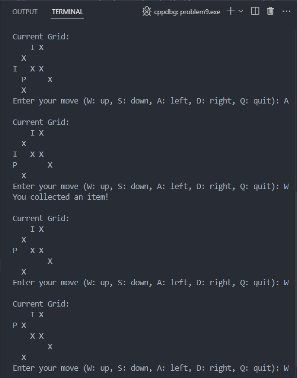
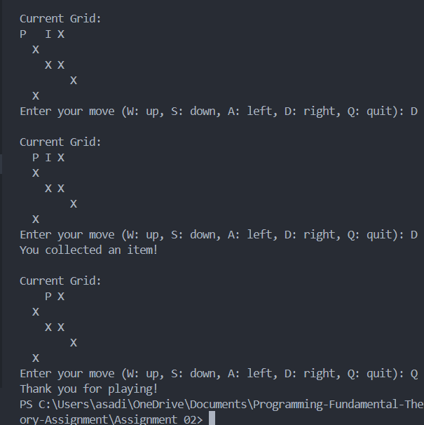

Write a C program to simulate a simple grid-based adventure game using a 2D array.
Game Description:
- The game consists of a 5x5 grid.
- Each cell can contain:
   -  An empty space (' ').
   - An item ('I') that the player can collect.
   - An obstacle ('X') that the player cannot pass through.
   - The player's position, represented by 'P'.

Requirements:
1. Display the grid and prompt the player for a move (W: up, S: down, A: left, D: right, Q: quit).
2. Update the player's position based on valid moves.
3. Collect items when the player moves to a cell containing an item (remove item from grid).
4. Prevent movement into obstacles ('X').
5. Continue until the player chooses to quit.
6. The grid is fixed at 5x5.
7. Only valid moves are allowed.
8. Handle invalid input gracefully.

### Output cases

### Approch 

Initialize a 5x5 grid with items, obstacles, and the player position. Display the grid and update the player’s position based on user input while enforcing movement rules, preventing obstacle crossings, and collecting items when encountered.

### Conclusion

Enhanced skills in grid-based navigation and user input handling while building logical checks for valid moves in a 2D array game [Got an idea for a future project].

<!-- making a 2d open world game with a render system(pokeamon like) or random generation game like (minecraft 2d or terraria) -->

