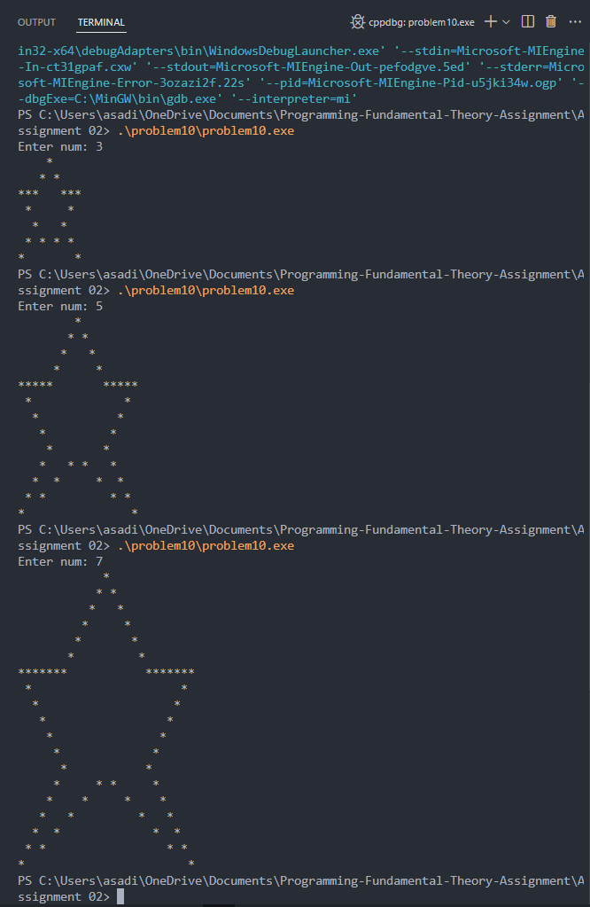
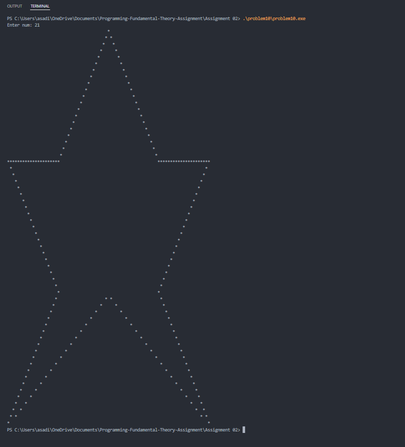

## Bonus question I presume (The hardest of them all)
Q. In the figures below, a star pattern is illustrated for the values N = 3 and N = 5. Your task is to create a C program that can print this pattern for odd values of N. Your solution should include the following
components:
1. Include meaningful, properly written English comments that explain the steps of your
program.
2. In the header of the file, describe the pattern. Include information about the length of sides,
the position of the center, and any other relevant details.
3. Prompt the user to enter the value of N. 
4. Run your program with an input value of 7. Capture a screenshot and save it as
'K23xxxx_Q01a.png.' [saved as problem10(1).png]
5. Run your program again with an input value of 21. Capture a screenshot and save it as
'K23xxxx_Q01b.png.' [saved as problem10(2).png]
6. For this question, submit only three files, 2 png image files and 1 .c file containing your code, and there's no need to create a separate folder for Q01.
The remaining marks will be based on the correctness, completeness, and the approach you take in
implementing the program.

### Output cases

### Approch 

The pattern was broken down into parts, starting with the top segment where spaces and asterisks were aligned to form the points. Moving on to the "arms" was manageable, and the middle section followed an easier pattern to print. Then came the challenge: the lower section was intricate, requiring every bit of calculation and brainpower to figure out the spacing in between the symbols, which wasn’t straightforward at all. I had to rely on the arithmetic progression formula <i><b> a+(n−1)×d </b></i> and lots of trial and error—spending about three hours fine-tuning it. Finally, I printed the last line individually to keep things simple.

### Conclusion

Working through this complex pattern was a real eye-opener in terms of logic-building and problem-solving. It pushed me to think creatively and apply mathematical tools like arithmetic progression in a new context. Overall, this challenge expanded my understanding of structured programming and helped me see how patience and breaking down problems can lead to clearer, more manageable solutions. 
One of the Best question i have dealth with!

