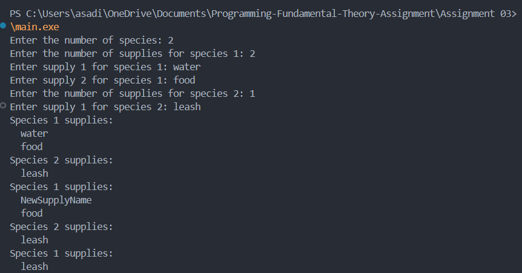

## Pets in Heart

### Output cases

### Approach
The program manages an inventory of supplies for different species. It allows the user to:
1. Add supplies for each species.
2. Update a specific supply for a species.
3. Remove a species and its supplies from the inventory.
4. Display the current inventory of supplies for all species.

The program uses dynamic memory allocation to handle the supplies for each species and ensures proper memory management by freeing allocated memory when it is no longer needed.

### Conclusion
This program demonstrates the use of dynamic memory allocation, array manipulation, and basic inventory management operations in C. It provides a simple yet effective way to manage supplies for different species, showcasing important concepts such as memory allocation, reallocation, and deallocation.
