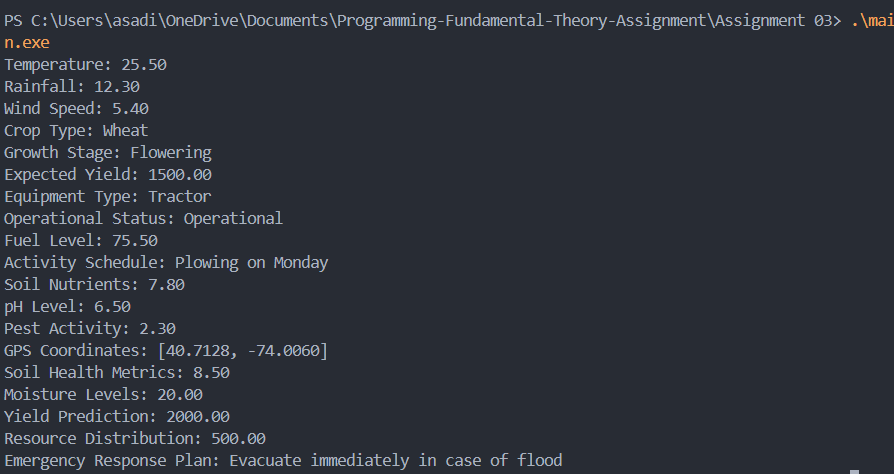

## Problem 06: Agricultural Data Management System

### Output cases

### Approach
In this problem, we define several structures to represent different aspects of an agricultural data management system. These structures include WeatherForecast, Crop, Equipment, Sensor, Field, RegionalHub, and CentralAnalyticsServer. We then initialize these structures with sample data and print the values to verify the correctness of our implementation.

### Conclusion
By defining and initializing these structures, we can effectively manage and analyze agricultural data. This approach allows for a comprehensive representation of various factors affecting crop yield and field management, providing valuable insights for decision-making in agriculture.
