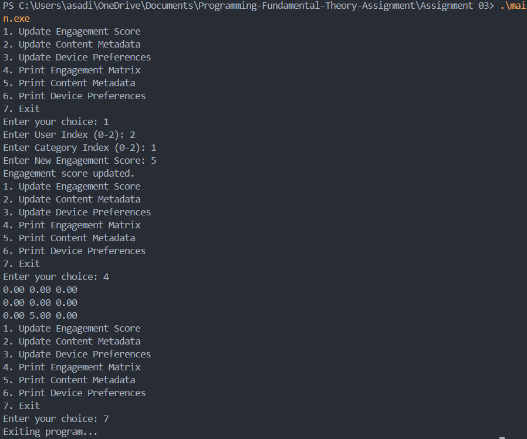

## User Engagement and Preferences Management System

### Output cases

### Approach 
In this problem, we manage user engagement scores, content metadata, and device preferences using a C program. The program initializes matrices for engagement scores, content metadata, and device preferences. It provides a menu-driven interface to update and print these matrices. The main steps are:
1. Initialize matrices for engagement scores, content metadata, and device preferences.
2. Provide options to update engagement scores, content metadata, and device preferences.
3. Print the matrices based on user choice.
4. Free allocated memory before exiting the program.

### Conclusion
This program demonstrates how to manage and update multiple matrices representing different aspects of user engagement and preferences. It uses dynamic memory allocation and provides a user-friendly interface for updating and viewing the data.
